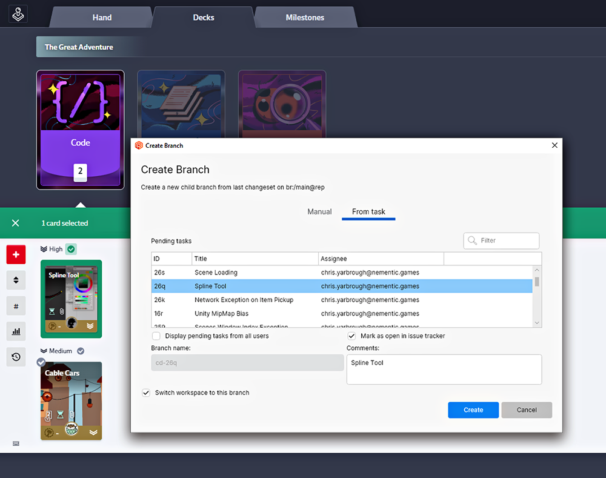
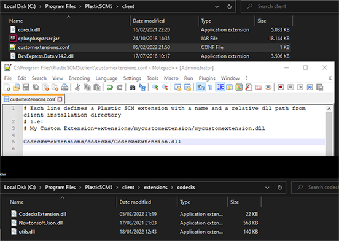
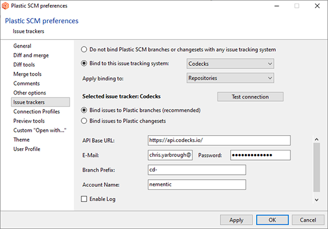

# Codecks Integration for PlasticSCM / Unity DevOps #



Adds support for the [Codecks](https://www.codecks.io/) issue tracker to [PlasticSCM](https://www.plasticscm.com/).

- Create new branch from task (Codecks card)
- Mark card as started when branch is created
- Branch prefix is configurable in the extension settings
- Open task externally (on Codecks website)

> _PlasticSCM_ was acquired by Unity in 2020 and is now called _Unity DevOps Version Control_.
> The features, including this extension, work mostly the same though.

For details about what a task and issue tracking extension can do, see
this [guide](https://docs.plasticscm.com/extensions/plastic-scm-version-control-task-and-issue-tracking-guide).

# Getting Started - User Setup

1) Assuming you already use PlasticSCM or Unity DevOps.
   The client can be downloaded [here](https://www.plasticscm.com/download).

2) [Download](https://github.com/chrisyarbrough/CodecksPlasticIntegration/releases)
   or build the CodecksExtension library (zip file with DLLs).

3) Place the `codecks` folder (containing the plugin and its dependencies)
   in the extensions directory of the PlasticSCM installation.
   With the default installation, the path should look like this:
	- Windows: `C:\Program Files\PlasticSCM5\client\extensions\codecks\CodecksExtension.dll`
	- macOS: `/Applications/PlasticSCM.app/Contents/extensions/codecks/CodecksExtension.dll`

   

4) Find the file `customextensions.conf`:
	- Windows: `C:\Program Files\PlasticSCM5\client\customextensions.conf`
	- macOS: `/Applications/PlasticSCM.app/Contents/MacOS/customextensions.conf`

   Add the following line to the file:
   > Codecks=extensions/codecks/CodecksExtension.dll

   You will need admin permissions to edit this file.

5) Open the preferences in the PlasticSCM GUI and configure the Codecks extension with your personal settings.

   

   Note that 'Account Name' is the subdomain of your organization used for the Codecks web frontend.

---

# Developer Setup

## Building from Source

**Prerequisites**

- .NET 7.0 SDK
- PlasticSCM 10.0.16.6505 (or newer)

Now testing: 11.0.16.9080

Of course the plugin should work in other (if not all) versions of PlasticSCM, but this specific one is known to work.
The beta GUI (PlasticX) of the same version is also supported internally.
At the time of writing, PlasticX allows creating a new branch from a task, but doesn't show task info anywhere else.

The codecks extension depends on libraries provided by PlasticSCM (e.g. issuetrackerinterface.dll).
In theory, these dependencies should be provided by the host process (the Plastic GUI), however,
the new beta GUI PlasticX does not load the utils.dll. For this reason, it was decided to
simply copy-paste the libraries during development and deploy them right next to the extension.
See the 'Libraries' folder in the repository.

The project solution includes a "Start Host" configuration which builds the extension and copies it directly to
the default PlasticSCM installation path and also launches the GUI client for interactive testing and debugging.

To allow this on your machine, either set the permissions of the
PlasticSCM/extensions/codecks directory to allow writing.
Or start your IDE with elevated privileges.
(at your own risk)

For example on macOS:

```zsh
EXT_DIR=/Applications/PlasticSCM.app/Contents/extensions/codecks/
sudo mkdir -p $EXT_DIR
sudo chown -R username $EXT_DIR
```

On Windows, right-click the folder, select _properties_ and allow 'write' permissions for your user.

## Testing

For the regular tests:

```bash
dotnet test
```

To run the _CodecksServiceTest_ configure your dotnet user secrets like so:

```bash
dotnet user-secrets set key value
```

with the following info:

| Key              | Description                                                         |
|------------------|---------------------------------------------------------------------|
| Codecks:Email    | Email address of your Codecks account.                              |
| Codecks:Password | Password associated with the Codecks email.                         |
| Codecks:Account  | Account name of your Codecks organization (not your personal name). |

## Additional Resources

The process for developing and configuring PlasticSCM extensions is documented
[here](https://www.plasticscm.com/documentation/extensions/plastic-scm-version-control-task-and-issue-tracking-guide#WritingPlasticSCMcustomextensions).

Codecks provides the [web API](https://manual.codecks.io/api/)
which is used by the extension to fetch task information and post status updates.
As of August 2023, the API is still in beta, but it has been very stable since 2022.

## Contributing

If you'd like to contribute or have any trouble using the extension, open a new issue to discuss it.
If you already have a working fix in place, please open a Pull Request, thank you!
