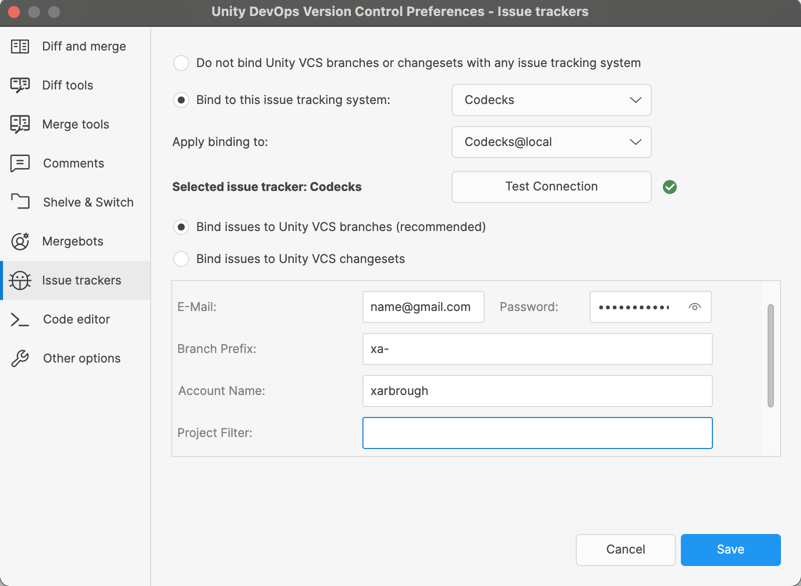

# Codecks Integration for PlasticSCM #
Adds support for the [Codecks](https://www.codecks.io/) issue tracker to [PlasticSCM](https://www.plasticscm.com/).

# Usage #
1) Download or build the CodecksExtension library.

2) Place the plugin and its dependencies in the extensions directory of the PlasticSCM installation.
   With the default installation on Windows, the extension should be placed at:
    > C:\Program Files\PlasticSCM5\client\extensions\codecks\CodecksExtension.dll

   

3) In the customextensions.conf file add the following line: 
    > Codecks=extensions/codecks/CodecksExtension.dll

    The configuration file can be found at:
    > C:\Program Files\PlasticSCM5\client\customextensions.conf

4) Open the preferences in the PlasticSCM GUI and configure the Codecks extension with your personal settings.

   

# Additional Resources
The process for developing and configuring PlasticSCM extensions is documented 
[here](https://www.plasticscm.com/documentation/extensions/plastic-scm-version-control-task-and-issue-tracking-guide#WritingPlasticSCMcustomextensions).

Codecks provides the [web API](https://manual.codecks.io/api/) 
which is used by the extension to fetch task information and post status updates.
As of February 2022, the API is in beta and not officially supported.

# Development and Building from Source
Since this was started as a personal project, 
the development setup may not be ideal when dealing with issues such as handling different PlasticSCM versions, 
user-specific installation paths or storing secret user data for testing.
Feel free to open an issue if you would like to contribute but face any obstacles.

**Requirements**
- .NET Framework 4.0
- C# 7.0
- PlasticSCM 10.0.16.6505

Of course the plugin should work in other (if not all) versions of PlasticSCM, but only this specific one was tested.
The beta version (PlasticX) should also work.

The codecks extension depends on libraries provided by PlasticSCM (e.g. issuetrackerinterface.dll).
In theory, these dependencies should be provided by the host process (the Plastic GUI), however,
the new beta GUI PlasticX does not load the utils.dll. For this reason it was decided to 
simply copy paste the libraries during development and deploy them right next to the extension.
See the 'Libraries' folder in the repository.

The solution includes a "Start Host" configuration which will build the extension and copy it directly to
the default PlasticSCM installation path and also launch the GUI client for interactive testing and debugging.
Most likely, your IDE will need to be started with admin permissions for this to work.

# Troubleshooting

> Unable to copy file x to y. Access to the path y is denied.

Try to start your IDE with admin permissions.

> My PlasticSCM installation path is different.

Change the output path in the project configuration, or better,
add a CodecksExtension.csproj.user file and overwrite the outputPath property locally.

> Runtime errors when loading the extension.

Unless the issue is caused by a specific programming error or incompatible API changes, 
it's likely that certain dependencies haven't been loaded correctly. 
Ensure that all required libraries are copied next to the extension DLL.
Maybe the version of one of the development libraries no longer matches PlasticSCM after an update.
Try to upgrade the dev lib with a newer version.
If specific types fail to load, Plastic may have changed their .NET target framework version.
